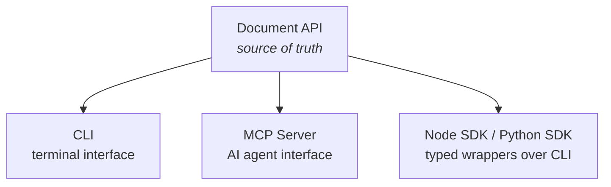

<Info>
Document Engine is in <strong>alpha</strong> and subject to breaking changes while the contract and adapters continue to evolve.
</Info>

Document Engine gives you four ways to read and edit `.docx` files without a visible editor:

| Surface | Best for | Runtime |
| --- | --- | --- |
| [Document API](/document-api/overview) | In-browser editing via `editor.doc.*` | Browser |
| [SDKs](/document-engine/sdks) | Backend automation with typed methods | Node / Python |
| [CLI](/document-engine/cli) | Scripts and CI pipelines | Any shell |
| [MCP Server](/document-engine/mcp) | AI agents (Claude Code, Cursor, custom) | Local subprocess |

All four share the same operation set. `find` is `editor.doc.find()` in the browser, `superdoc.doc.find()` in the SDK, `superdoc find` in the CLI, and `superdoc_find` in MCP.

## How it works

The Document API defines the canonical operations. The CLI and MCP server wrap them for different consumers. The SDKs manage the CLI process and expose typed methods.

## Which surface should I use?

| Your setup | Surface | Why |
| --- | --- | --- |
| Web app with a visible editor | [Document API](/document-api/overview) | Direct access via `editor.doc.*` — no network round-trips |
| AI agent (Claude Code, Cursor, Windsurf, custom) | [MCP Server](/document-engine/mcp) | Sessions keep the editor alive across tool calls |
| Backend automation (Node.js / Python) | [SDKs](/document-engine/sdks) | Typed methods, session management, error handling built in |
| Shell scripts or CI pipelines | [CLI](/document-engine/cli) | Stateless one-shot commands — no process to manage |
| Serverless (Lambda, Vercel, Workers) | [CLI](/document-engine/cli) or [SDKs](/document-engine/sdks) | Open the file, run the operation, return the result |

